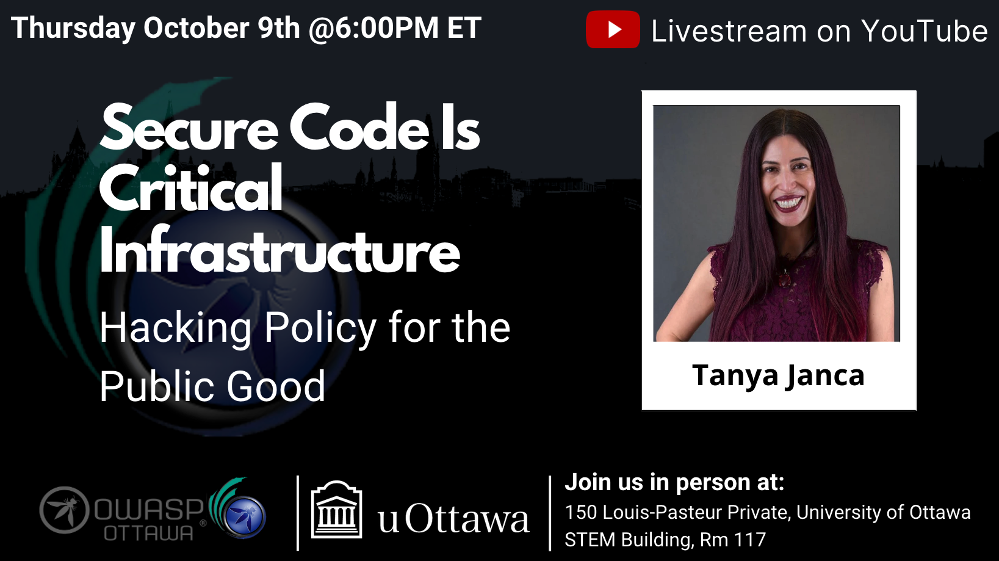

---

title: NextEvent
displaytext: Next Event
layout: null
tab: true
order: 1
tags: ottawa
meetup-group: OWASP-Ottawa

---

## Next Meeting/Event(s)

[//]: # (Comment: When updating the next event info also update the homepage)

---

## OWASP Ottawa Chapter upcoming events can be found on Meetup:

[https://www.meetup.com/OWASP-Ottawa/](https://www.meetup.com/OWASP-Ottawa)

---

## Thursday October 9th, 2025
### Details

Welcome to our in-Person Meetup at the University of Ottawa

In-Person Location:
150 Louis-Pasteur Private, Ottawa,
University of Ottawa
Room 117

We will continue to Live Stream on our YouTube channel. (https://www.youtube.com/@OWASP_Ottawa). Subscribe to our YouTube channel, set a reminder and you’ll get a notification as soon as we go live!

YouTube Live Stream Link: TBA

6:00 PM EST Arrival, setup, mingle, PIZZA!!!
6:30 PM EST Technical Talks
* Introduction to OWASP Ottawa, Public Announcements.
* "Secure Code Is Critical Infrastructure - Hacking Policy for the Public Good" with Tanya Janca

### Abstracts:
***Title: Secure Code Is Critical Infrastructure - Hacking Policy for the Public Good***
What happens when a security professional tries to help a government fix its insecure software? In this talk, I’ll share my story: from writing a secure coding policy and offering it to the Canadian government, lobbying elected officials, contacting agencies like CRA about their poor security practices—and being met with silence, deflection, or outright dismissal. I didn’t stop there. I wrote public letters, went on podcasts, published on Risky Biz, even got interviewed by CBC. But the institutions in charge of protecting our data? Either silence or “No comment, because security." This isn’t just a rant—it’s a roadmap. I’ll show you the secure coding guideline I created (free to reuse), explain why governments need public-facing AppSec policies, and outline how we can push for secure-by-default practices as citizens, hackers, and builders. Because secure code isn’t just for dev teams—it’s for democracy, privacy, and public safety. Let’s make it law. Let’s make it public.

### Speakers:
***Tanya Janca*** aka SheHacksPurple, is the best-selling author of 'Alice and Bob Learn Secure Coding’ and 'Alice and Bob Learn Application Security’. She is currently the CEO and secure coding trainer at She Hacks Purple Consulting. Over her 28-year IT career she has won countless awards (including OWASP Lifetime Distinguished Member and Hacker of the Year), spoken all over the planet, and is a prolific blogger. Tanya has trained thousands of software developers and IT security professionals, via her online academies (We Hack Purple and Semgrep Academy), and her live training programs. Having performed counter-terrorism, led security for the 52nd Canadian general election, developed or secured countless applications, Tanya Janca is widely considered an international authority on the security of software.

Advisor: Smithy, Katilyst
Board Member: Forte Group
Founder: We Hack Purple, OWASP DevSlop, #CyberMentoringMonday, WoSEC

