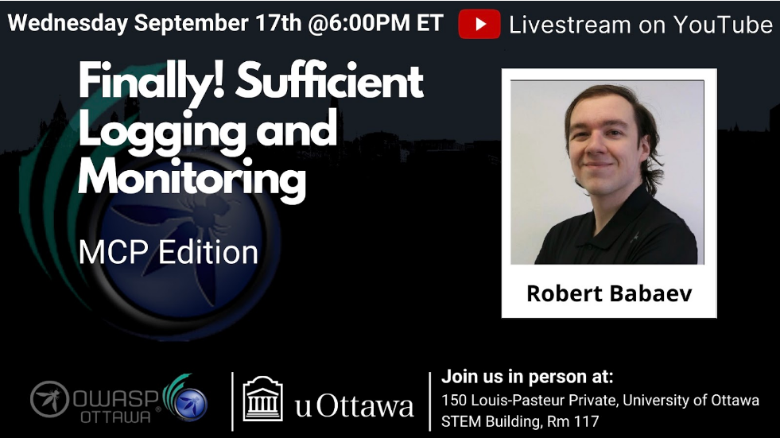

---

title: NextEvent
displaytext: Next Event
layout: null
tab: true
order: 1
tags: ottawa
meetup-group: OWASP-Ottawa

---

## Next Meeting/Event(s)

[//]: # (Comment: When updating the next event info also update the homepage)

---

## OWASP Ottawa Chapter upcoming events can be found on Meetup:

[https://www.meetup.com/OWASP-Ottawa/](https://www.meetup.com/OWASP-Ottawa)

---

## Wednesday August 20th, 2025
### Details

Welcome to our in-Person Meetup at the University of Ottawa

In-Person Location:
150 Louis-Pasteur Private, Ottawa,
University of Ottawa
Room 117

We will continue to Live Stream on our YouTube channel. (https://www.youtube.com/@OWASP_Ottawa). Subscribe to our YouTube channel, set a reminder and you’ll get a notification as soon as we go live!

YouTube Live Stream Link: TBA

6:00 PM EST Arrival, setup, mingle, PIZZA!!!
6:30 PM EST Technical Talks
* Introduction to OWASP Ottawa, Public Announcements.
* "Finally! Sufficient Logging and Monitoring (MCP Edition) with Robert Babaev" with Robert Babaev

### Abstracts:
***Title: Finally! Sufficient Logging and Monitoring (MCP Edition) with Robert Babaev***
Observability is a surprisingly important part of security, yet it's often the most neglected. In an age of AI, this can get costly, especially if you don't even know something is going wrong until you get 17,000 support tickets.

We'll go over some relatively painless approaches to getting set up with centralized logging, metrics, tracing, and a rudimentary SIEM. We'll also go over some other potential avenues for achieving better observability, and some tips and tricks for developers.

### Speakers:
***Robert Babaev*** is a recent graduate of Carleton University with an Honours Bachelor of Computer Science, specializing in Computer and Internet Security. He has done multiple internships at major Canadian cyber companies like Barracuda Networks and Software Secured, research into authentication and access control frameworks, and competed internationally in Athens and Prague in competitions through CyberSci.

