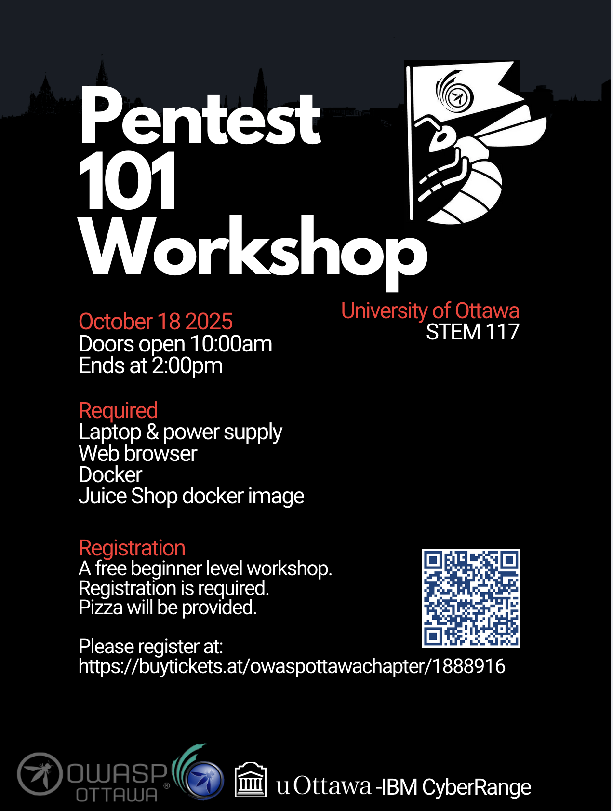

---

title: NextEvent
displaytext: Next Event
layout: null
tab: true
order: 1
tags: ottawa
meetup-group: OWASP-Ottawa

---

## Next Meeting/Event(s)

[//]: # (Comment: When updating the next event info also update the homepage)

---

## OWASP Ottawa Chapter upcoming events can be found on Meetup:

[https://www.meetup.com/OWASP-Ottawa/](https://www.meetup.com/OWASP-Ottawa)

---

## Saturday October 18th, 2025
### Details

Welcome to our in-Person Guided Pentest 101 Workshop at the University of Ottawa.

In-Person Location:
150 Louis-Pasteur Private, Ottawa,
University of Ottawa
Room 117

### Abstract:
***Title:*** OWASP Ottawa Pentest 101 Workshop: An introduction to Application Pentesting using OWASP Juice-Shop

This is a beginner hands on guided workshop introducing web application penetration testing.

***This is a free event but registration is required. You MUST get a ticket to attend. Tickets can be reserved at:***
https://buytickets.at/owaspottawachapter/1888916

We'll explore a handful of vulnerabilities, cover topics such as the workflow of a pentest, creating effective vulnerability reports, and introduce participants to some basic pentest tooling. If you're interested in app exploitation and you want to get hands on with some basics, we'll get you started.

### Setup
The workshop will be "hands on" where you will use your laptop against a training environment running on your laptop. Please setup your laptop prior to the workshop so the event will run smoothly. 

1. Bring your laptop
2. Install docker on your laptop
   - windows: https://docs.docker.com/desktop/setup/install/windows-install/
   - Mac: https://docs.docker.com/desktop/setup/install/mac-install/
   - Linux: https://docs.docker.com/engine/install/
            - Ubuntu: https://www.digitalocean.com/community/tutorials/how-to-install-and-use-docker-on-ubuntu-20-04
3. Install OWASP Juice Shop Docker container:
        https://pwning.owasp-juice.shop/companion-guide/latest/part1/running.html#_docker_image

### Presenter:
***Fennix*** After a ten year career in a variety of technical roles, when the opportunity to jump into a pentesting role came up Fennix jumped at the chance. That was nearly a decade ago and in the time since he has several hundred CVEs to his name and numerous strong opinions about the state of the industry. Over that time he created and delivered numerous presentations and training courses for a variety of audiences ranging from security focals and developers to administrative and sales staff to, well, just about anyone. For the past five years he has been part of the core organizing committee and core challenge development team for CyberSci, Canada's post-secondary cybersecurity challenge.
