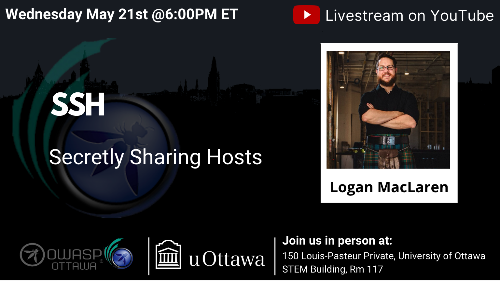

---

title: NextEvent
displaytext: Next Event
layout: null
tab: true
order: 1
tags: ottawa
meetup-group: OWASP-Ottawa

---

## Next Meeting/Event(s)

[//]: # (Comment: When updating the next event info also update the homepage)

---

## OWASP Ottawa Chapter upcoming events can be found on Meetup:

[https://www.meetup.com/OWASP-Ottawa/](https://www.meetup.com/OWASP-Ottawa)

---

## Wednesday May 21st, 2025
### Details

Welcome to our in-Person Meetup at the University of Ottawa

In-Person Location:
150 Louis-Pasteur Private, Ottawa,
University of Ottawa
Room 117

We will continue to Live Stream on our YouTube channel. (https://www.youtube.com/@OWASP_Ottawa). Subscribe to our YouTube channel, set a reminder and you’ll get a notification as soon as we go live!

YouTube Live Stream Link: TBA

6:00 PM EST Arrival, setup, mingle, PIZZA!!!
6:30 PM EST Technical Talks
* Introduction to OWASP Ottawa, Public Announcements.
* "SSH: Secretly Sharing Hosts" with Logan MacLaren

### Abstract:
SSH (Secure Shell) is one of the most useful tools for access to Linux systems and, as the name implies, is quite secure. Without exploiting any product vulnerabilities, theoretical or real, this talk explores ways that an attacker can abuse intentional SSH functionality to hijack existing sessions, bypass MFA and passphrase protections, avoid firewall-imposed limitations, masquerade as other users, and extend access to internal resources beyond the network perimeter.

Attendees should walk away with a better understanding of how SSH multiplexing, agent forwarding, and tunneling work and are abused, as well as being armed with detection and mitigation strategies to help prevent impact to their systems.

### Speakers:
**Logan MacLaren** is a Senior Red Team Engineer at GitHub where he spends his time finding out how to best break (and fix) security controls. When not hacking on GitHub itself, Logan can be found doing security research focused on open source projects or learning and refining skills with CTF challenges!
