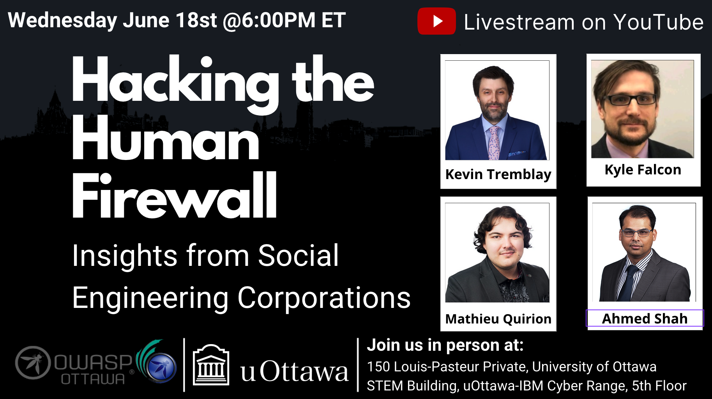

---

title: NextEvent
displaytext: Next Event
layout: null
tab: true
order: 1
tags: ottawa
meetup-group: OWASP-Ottawa

---

## Next Meeting/Event(s)

[//]: # (Comment: When updating the next event info also update the homepage)

---

## OWASP Ottawa Chapter upcoming events can be found on Meetup:

[https://www.meetup.com/OWASP-Ottawa/](https://www.meetup.com/OWASP-Ottawa)

---

## Wednesday June 18th, 2025
### Details

Welcome to our in-Person Meetup at the University of Ottawa

In-Person Location:
150 Louis-Pasteur Private, Ottawa,
University of Ottawa
Room 117

We will continue to Live Stream on our YouTube channel. (https://www.youtube.com/@OWASP_Ottawa). Subscribe to our YouTube channel, set a reminder and you’ll get a notification as soon as we go live!

YouTube Live Stream Link: TBA

6:00 PM EST Arrival, setup, mingle, PIZZA!!!
6:30 PM EST Technical Talks
* Introduction to OWASP Ottawa, Public Announcements.
* Hacking the Human Firewall, Insights from Social Engineering Corporations.

### Abstract:
Despite significant investments in cutting-edge security technologies, the human element remains the weakest link in cybersecurity. Attackers continuously exploit human behavior to bypass even the most advanced technology defences. This presentation will provide experiences of hands-on real-world social engineering campaigns, mirroring the tactics used by sophisticated threat actors.
We will explore:
• OSINT - Determining Targets and Entry Points
• NIST Phish Scale - Evaluating the Content of a Phishing Email
• Email Phishing - How Attackers Get SPAM Into the Corporate Inbox
• Phone Social Engineering - Experiences in Impersonation and Taking Over Accounts
• Physical Security - Outcomes from Just Hanging Around the Office
Attendees will gain valuable insights into the psychology and strategies behind social engineering attacks, along with practical safeguards to strengthen their organization’s security posture against these evolving threats.

### Speakers:
**KyleFalcon, Ahmed Shah, MathieuQuirion, and KevinTremblay** collectively serve as Security and Governance Risk and Compliance (GRC) analysts at Malleum Information Security in Ottawa, Canada. They are experienced in delivering cloud security assessments; leading red and purple team engagements; conducting penetration tests; performing digital forensics and incident response (DFIR); and carrying out physical security assessments as well as GRC activities for private sector clients and government agencies.
