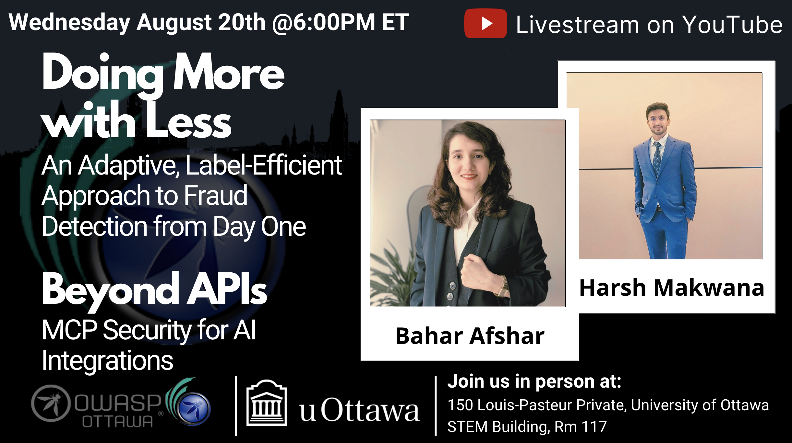

---

title: NextEvent
displaytext: Next Event
layout: null
tab: true
order: 1
tags: ottawa
meetup-group: OWASP-Ottawa

---

## Next Meeting/Event(s)

[//]: # (Comment: When updating the next event info also update the homepage)

---

## OWASP Ottawa Chapter upcoming events can be found on Meetup:

[https://www.meetup.com/OWASP-Ottawa/](https://www.meetup.com/OWASP-Ottawa)

---

## Wednesday August 20th, 2025
### Details

Welcome to our in-Person Meetup at the University of Ottawa

In-Person Location:
150 Louis-Pasteur Private, Ottawa,
University of Ottawa
Room 117

We will continue to Live Stream on our YouTube channel. (https://www.youtube.com/@OWASP_Ottawa). Subscribe to our YouTube channel, set a reminder and you’ll get a notification as soon as we go live!

YouTube Live Stream Link: TBA

6:00 PM EST Arrival, setup, mingle, PIZZA!!!
6:30 PM EST Technical Talks
* Introduction to OWASP Ottawa, Public Announcements.
* "Doing More with Less: An Adaptive, Label-Efficient Approach to Fraud Detection from Day One" with Bahar Afshar
* "Beyond APIs: MCP Security for AI Integrations" with Harsh Makwana

### Abstracts:
***Doing More with Less: An Adaptive, Label-Efficient Approach to Fraud Detection from Day One with Bahar Afshar***
Detecting fraud in financial systems is like finding a needle in a haystack; fraudulent transactions are rare, labeling them is expensive, and sometimes, we don’t have any labels at all. In this talk, I’ll present a new approach that tackles these challenges by combining different learning strategies in an adaptive way. We’ll explore how to start detecting fraud even when labeled examples are extremely limited and how we can prioritize the most suspicious cases using smart, explainable tools. The goal is to make fraud detection not just more accurate but also more efficient and easier to understand for human experts. Whether you're working in cybersecurity, finance, or just curious about the future of AI-powered decision-making, this talk will offer insights into how we can do more with less when fighting financial crime.

***Beyond APIs: MCP Security for AI Integrations with Harsh Makwana*.***
The Model Context Protocol (MCP) is rapidly becoming the standard for LLM integration with external tools and data. However, this accelerated adoption has often sidelined crucial security hardening. This talk will directly address the inherent security challenges within MCP implementations, providing essential strategies to build robust, secure AI agents.

### Speakers:
***Bahar Emami Afshar*** is in the process of completing their Master’s in Computer Science at the University of Ottawa, specializing in AI. During this time they worked under the supervision of Dr. Paula Branco and completed a research internship at H3M Analytics Inc. Their research focuses on explainable AI, anomaly detection, and label-efficient learning, with a particular emphasis on fraud detection and financial crime. Over the past year, Bahar has published several first-author papers exploring adaptive and efficient strategies for detecting fraud in low-label and imbalanced scenarios. Bahar is passionate about building intelligent systems that are more transparent, trustworthy, and impactful in real-world settings.

***Harsh Makwana***, M.Eng, is an Application Security Consultant at Software Secured with over 3 years of experience in penetration testing. An alumnus of the University of Ottawa, Harsh is a general technologist with a strong interest in the advancements of both cybersecurity and industrial robotics. Outside of work, he enjoys exploring photography and illustration as creative pursuits.

