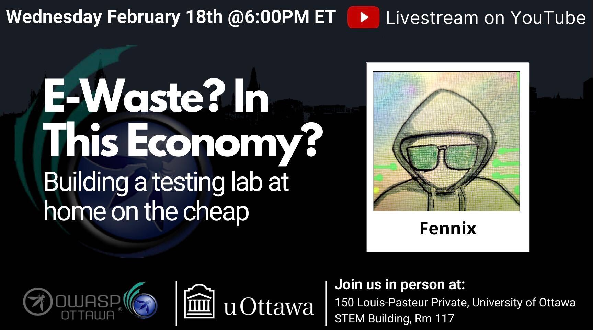

---

title: NextEvent
displaytext: Next Event
layout: null
tab: true
order: 1
tags: ottawa
meetup-group: OWASP-Ottawa

---

## Next Meeting/Event(s)

[//]: # (Comment: When updating the next event info also update the homepage)

---

## Wednesday February 18th, 2026
### Details

Welcome to our in-Person Meetup at the University of Ottawa

In-Person Location:
150 Louis-Pasteur Private, Ottawa,
University of Ottawa
Room 117

We will continue to Live Stream on our YouTube channel. (https://www.youtube.com/@OWASP_Ottawa). Subscribe to our YouTube channel, set a reminder and you’ll get a notification as soon as we go live!

YouTube Live Stream Link: https://www.youtube.com/watch?v=7ytDY5GmAtM

6:00 PM EST Arrival, setup, mingle, PIZZA!!!
6:30 PM EST Technical Talks
* Introduction to OWASP Ottawa, Public Announcements.
* "E-Waste? In This Economy? Building a testing lab at home on the cheap." with Fennix

### Abstract:

With cloud pricing marching ever higher and the environment becoming an afterthought in the AI boom, being able to learn on the cheap is ever critical. In this presentation we'll demo how to build out a testing lab based on Open Source solutions and old hardware you might have at the bottom of a closet, as well as provide some resources to help make that happen.

### Speaker:
***Fennix (he/him)***: After a ten year career in a variety of technical roles, when the opportunity to jump into a pentesting role came up Fennix jumped at the chance. That was nearly a decade ago and in the time since he has several hundred CVEs to his name and numerous strong opinions about the state of the industry. Over that time he created and delivered numerous presentations and training courses for a variety of audiences ranging from security focals and developers to administrative and sales staff to, well, just about anyone. For the past five years he has been part of the core organizing committee and core challenge development team for CyberSci, Canada's post-secondary cybersecurity challenge.
