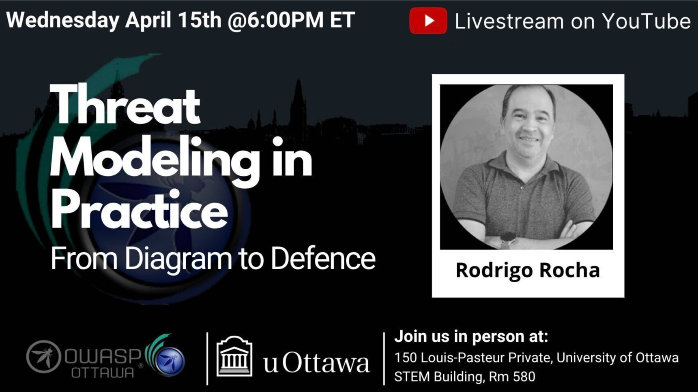

---

title: NextEvent
displaytext: Next Event
layout: null
tab: true
order: 1
tags: ottawa
meetup-group: OWASP-Ottawa

---

## Next Meeting/Event(s)

[//]: # (Comment: When updating the next event info also update the homepage)

---

## Wednesday April 15th, 2026
### Details

Welcome to our in-Person Meetup at the University of Ottawa

In-Person Location:
150 Louis-Pasteur Private, Ottawa,
University of Ottawa
Room 580

We will continue to Live Stream on our YouTube channel. (https://www.youtube.com/@OWASP_Ottawa). Subscribe to our YouTube channel, set a reminder and you’ll get a notification as soon as we go live!

YouTube Live Stream Link: https://www.youtube.com/watch?v=fTBf49d84Yo

6:00 PM EST Arrival, setup, mingle, PIZZA!!!
6:30 PM EST Technical Talks
* Introduction to OWASP Ottawa, Public Announcements.
* "Threat Modeling in Practice: From Diagram to Defense" with Rodrigo Rocha

### Abstract:

Modern development teams often view Threat Modeling as heavy, theoretical, or compliance-driven — and as a result, it gets skipped. This session introduces a practical, lightweight approach to Threat Modeling that fits directly into agile workflows.
Using a real-world healthcare portal example, we walk step-by-step from drawing a simple data flow diagram to identifying critical assets, mapping real attack scenarios (via MITRE CAPEC), linking root causes (CWE), and translating them into testable security requirements using OWASP ASVS. The session demonstrates how to turn abstract risks into concrete sprint tickets developers can actually implement.
We also explore why Threat Modeling frequently fails in organizations and how Security Champions programs can scale security culture across engineering teams.

### Speaker:
***Rodrigo Rocha*** is a Security Enablement Leader and GRC Consultant with over 15 years of experience bridging the gap between security and application security. He specializes in building Security Champions Programs that empower developers to ship faster and more securely—without slowing down innovation.
Rodrigo spent eight years as an Application Security Specialist before transitioning into governance and compliance, giving him a rare ability to communicate fluently with both developers and auditors. He has designed and scaled Security Champions Programs across 200+ engineering teams, trained over 6,000 developers at Brazil's largest companies.
His compliance expertise spans SOC 2 Type I/II, ISO 27001, NIST CSF, and CIS Controls—achieving audit success while maintaining engineering velocity, including clean SOC 2 audits with 45% less preparation time through automation. Rodrigo has also published thought leadership with the CNCF on cloud-native security approaches.

