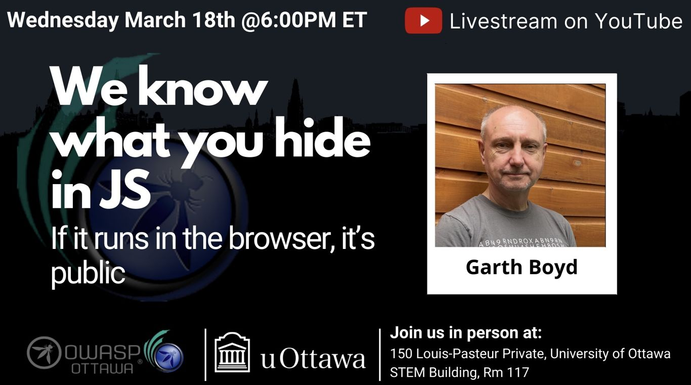

---

title: NextEvent
displaytext: Next Event
layout: null
tab: true
order: 1
tags: ottawa
meetup-group: OWASP-Ottawa

---

## Next Meeting/Event(s)

[//]: # (Comment: When updating the next event info also update the homepage)

---

## Wednesday March 18th, 2026
### Details

Welcome to our in-Person Meetup at the University of Ottawa

In-Person Location:
150 Louis-Pasteur Private, Ottawa,
University of Ottawa
Room 117

We will continue to Live Stream on our YouTube channel. (https://www.youtube.com/@OWASP_Ottawa). Subscribe to our YouTube channel, set a reminder and you’ll get a notification as soon as we go live!

YouTube Live Stream Link: https://www.youtube.com/watch?v=fTBf49d84Yo

6:00 PM EST Arrival, setup, mingle, PIZZA!!!
6:30 PM EST Technical Talks
* Introduction to OWASP Ottawa, Public Announcements.
* "We know what you hide in JS" with Garth Boyd

### Abstract:

Client-side JavaScript plays a crucial role in the development and functionality of Single Page Applications (SPAs) prevalent in modern web applications. Unfortunately, JavaScript code delivered to the browser can contain sensitive information due to development error, oversight, or misunderstanding. These details can provide attackers with a variety of insights that can be leveraged to exploit vulnerabilities in a web application. This presentation delves into the techniques and tools essential for performing comprehensive reconnaissance on client-side JavaScript files, aiming to uncover hidden endpoints, sensitive information, and potential security vulnerabilities. Attendees will gain practical knowledge on the importance of reconnaissance, the types of tools available, and how to effectively analyze client-side JavaScript files to gather actionable intelligence. This presentation is ideal for cybersecurity professionals, web developers, and penetration testers who are keen to deepen their understanding of client-side security. It provides valuable insights for anyone involved in securing modern web applications and protecting sensitive data from unauthorized access.

### Speaker:
***Garth Boyd***: Senior Application Security/Cloud Security Architect specializing in Secure Software Architecture and security research with experience supporting development organizations. Founder of DeviousPlan, a boutique security firm specializing in Security Architecture, Threat Modelling, Securing the public cloud, Security Training and Penetration Testing. A lifelong learner who enjoys crafting solutions to interesting and tough problems and thinking of six impossible things before breakfast. Garth also volunteers for the Ottawa OWASP chapter

