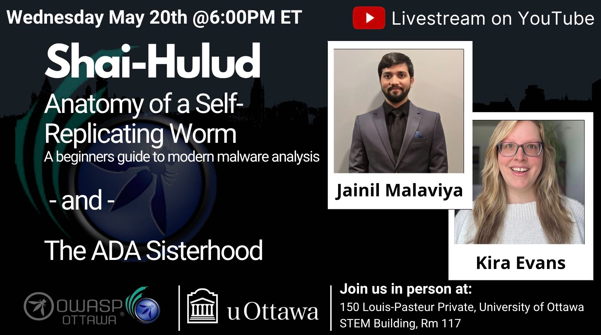

---

title: NextEvent
displaytext: Next Event
layout: null
tab: true
order: 1
tags: ottawa
meetup-group: OWASP-Ottawa

---

## Next Meeting/Event(s)

[//]: # (Comment: When updating the next event info also update the homepage)

---

## Wednesday May 20th, 2026
### Details

Welcome to our in-Person Meetup at the University of Ottawa

In-Person Location:
150 Louis-Pasteur Private, Ottawa,
University of Ottawa
Room 117

We will continue to Live Stream on our YouTube channel. (https://www.youtube.com/@OWASP_Ottawa). Subscribe to our YouTube channel, set a reminder and you’ll get a notification as soon as we go live!

YouTube Live Stream Link: https://www.youtube.com/watch?v=TXpb7ooZZRg

6:00 PM EST Arrival, setup, mingle, PIZZA!!!
6:30 PM EST Technical Talks
* Introduction to OWASP Ottawa, Public Announcements.
* Building Opportunities Before You Feel Ready (The Ada Sisterhood)" with Kira Evans
* “Shai-Hulud: Anatomy of a Self-Replicating Worm (A Beginner’s Walkthrough of Modern Malware Analysis)” with Jainil Malaviya

### Abstract:

***Building Opportunities Before You Feel Ready (The Ada Sisterhood) with Kira Evans***
This talk shares the story of how The Ada Sisterhood grew from a small student club into community partnerships, networking events, nonprofit tech projects, and hackathons across Ottawa’s tech community. Kira will speak about the power of volunteering, building connections, and taking action before feeling fully prepared, along with how community involvement opened unexpected doors in tech leadership and event organizing.

***Shai-Hulud: Anatomy of a Self-Replicating Worm (A Beginner’s Walkthrough of Modern Malware Analysis) with Jainil Malaviya***
In September 2025, a self-replicating worm called Shai-Hulud compromised over 500 npm packages, with no humans in the loop. By November, follow-on waves had pushed stolen secrets to more than 25,000 public GitHub repos. This talk walks through how a malware analyst would read it: static analysis, YARA detection, dynamic analysis, and a deep dive into Shai-Hulud's credential harvesting and self-replication mechanics. If you've never opened a malware sample but you've always wanted to, this hour is for you.

### Speaker:
***Kira Evans*** recently completed the Computer Programming program at Algonquin College and is the founder of The Ada Sisterhood, a student initiative created to help students build confidence, connections, and real-world experience in tech. What started as a small campus club grew into partnerships with nonprofits, networking events, hackathons, and leadership opportunities across the Ottawa tech community. Kira currently serves on the 2026 Board of Directors for JCI Ottawa as Director of External Relations.

***Jainil Malaviya*** is a Security Engineer at Nokia Canada Inc and an April 2026 graduate of Northeastern University. Based in Ottawa, he is OSCP+ certified, serves as the OffSec Canada Chapter Ambassador, and is a member of the Cloud Village team that runs at DEF CON, RSAC, and major BSides events.
Attendees
