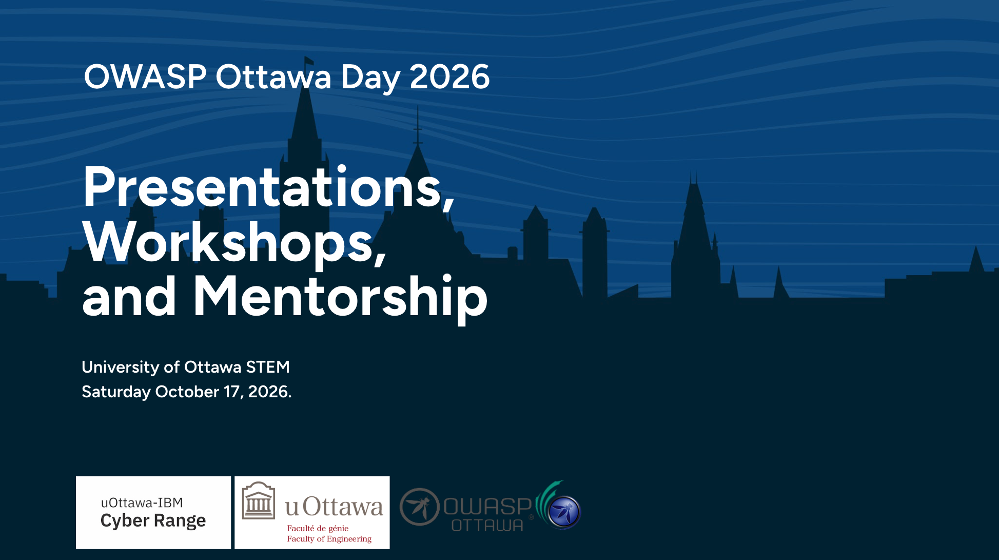

---

title: OWASPOttawaDay2026 
displaytext: OWASP Ottawa Day 2026 
layout: null
tab: true
order: 1
tags: ottawa
meetup-group: OWASP-Ottawa

---

# OWASP Ottawa Day 2026



**Presentations, Workshops, and Mentorship**

| | |
|---|---|
| **Date** | Saturday, October 17, 2026 |
| **Doors / On-site Registration** | 8:00 AM |
| **Program Start** | 8:45 AM |
| **Location** | University of Ottawa — 150 Louis-Pasteur Private · STEM Complex, Ottawa, Ontario |
| **Cost** | Free |
| **Registration** | Required for the speaker track and the OSINT workshop — tickets TBA |

A full day of application security learning hosted by the OWASP Ottawa chapter. The day is built
around three parts: a **speaker track**, a hands-on **OSINT workshop**, and a **mentoring** section.

> **Important:** The event is **free**, but **registration is required for the speaker track
> or the OSINT workshop**. Each uses a **separate ticket** You can only register for one, so book only the one you plan to attend. Workshop seating is limited.

---

## Registration

Attendance is **free**, but **registration is required for the speaker track and for the OSINT
workshop**. The two are ticketed separately — one ticket does not cover the other, so register for
only the session you plan to attend. Ticketing links are not yet available; this page will be updated as
soon as they are published.

| What | Cost | Registration | Link |
|---|---|---|---|
| Speaker Track | Free | Required — its own ticket | **TBA** |
| OSINT Workshop | Free | Required — a separate ticket | **TBA** |
| Mentoring | Free | No separate ticket — details TBA | — |

---

## Speaker Track

A day of talks from practitioners on application security, secure development, threat modelling,
and the current state of the OWASP projects.

- **Cost:** free — registration required
- **Registration:** a separate ticket from the OSINT workshop
- **Room:** STM 117
- **Start:** 8:45 AM, following the 9:00 AM keynote
- **Speakers and schedule:** TBA

## OSINT Workshop

A hands-on, instructor-led workshop on Open Source Intelligence techniques. Attendees work through
practical exercises rather than sitting through slides.

- **Cost:** free — registration required
- **Registration:** a **separate ticket** from the speaker track
- **Room:** STM 564
- **Start:** 9:30 AM
- **Seating:** limited; register early
- **Bring:** a laptop (setup details and any pre-requisites will be posted before the event)
- **Details:** TBA

## Mentoring

Mentoring sessions connect attendees with experienced security practitioners for career guidance,
resume and portfolio feedback, and advice on breaking into or growing within application security.

```
Are you an experienced Security Professional in Ottawa and wish to share your wisdom with students
and the community?
```
[Mentor signup form](https://forms.cloud.microsoft/r/GaJ56qGZxA)

- Those seeking a session with mentor is open to students, career changers, and early-career practitioners
- **Room:** STM 464
- Format, sign-up process, and mentor list: TBA


## Volunteering

We are looking for volunteers to help with all aspects of making this a successful and educational event for the community.
If you wish to give back to your community we would love your help. 
[Volunteer Sign Up Form](https://forms.gle/JqiA1Ak6fPrXNsHq6)

---

## Schedule

The full agenda is being finalized. Doors open and on-site registration begins at **8:00 AM**, with
the program starting at **8:45 AM**.

| Time | Session |
|---|---|
| 8:00 AM | Doors open — on-site registration and check-in |
| 8:45 AM | Welcome and opening remarks |
| 9:00 – 9:30 AM | Keynote — speaker TBA |
| 9:30 AM | Speaker track sessions begin — STM 117 |
| 9:30 AM | OSINT workshop begins — STM 564 |
| TBA | Mentoring sessions — STM 464 |
| 5:00 PM | Closing remarks — STM 117 |
| 6:00 PM | The AfterParty — location TBA |

---

## Venue

**University of Ottawa — STEM Complex**
Ottawa, Ontario, Canada

Rooms:

- **Speaker Track** — STM 117
- **Closing Remarks** — STM 117
- **OSINT Workshop** — STM 564
- **Mentoring** — STM 464

Parking and transit details: TBA.

---

## Hosted and Supported By

- OWASP Ottawa Chapter and the OWASP Foundation
- uOttawa–IBM Cyber Range
- University of Ottawa, Faculty of Engineering
- Other sponsors TBA

---

## Stay Informed

Registration links, the speaker list, and the final schedule will be posted to this repository and
announced through the OWASP Ottawa chapter channels. Watch this repository for updates.

For questions about the event, sponsorship, or speaking, contact the OWASP Ottawa chapter organizers.

* [Mastodon](https://infosec.exchange/@OWASP_Ottawa)
* [Bluesky](https://bsky.app/profile/owaspottawa.bsky.social)
* [LinkedIN](https://www.linkedin.com/company/owasp-ottawa)


