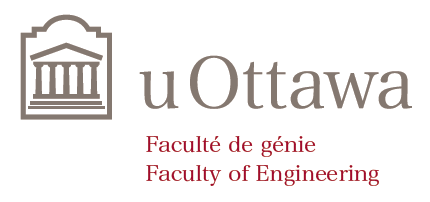
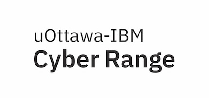
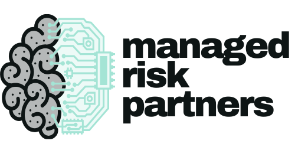

---

title: Sponsorship
displaytext: How to Support OWASP Ottawa
layout: null
tab: true
order: 1
tags: ottawa
meetup-group: OWASP-Ottawa

---

## Chapter Supporters

The following are the list of organizations that have generously supported the Ottawa Chapter:

   

## How to Support OWASP Ottawa

### Financially

Specifying OWASP Ottawa in your donation helps support OWASP and the Ottawa Chapter to provide quality security education.

1. Browse to https://owasp.org/ottawa
2. Click the green Donate button to the top right.
3. Select an amount.
4. Click "Publicly list me as a support of OWASP Ottawa".
5. Enter your details.
6. Prove to a robot, that you are not a robot.
7. Provide payment information.

### Other ways to Support OWASP Ottawa

There are other ways you can support the chapter. These can include:

- SWAG.
- Food or Beverages at events.
- Security content.

Contact us for more details.
